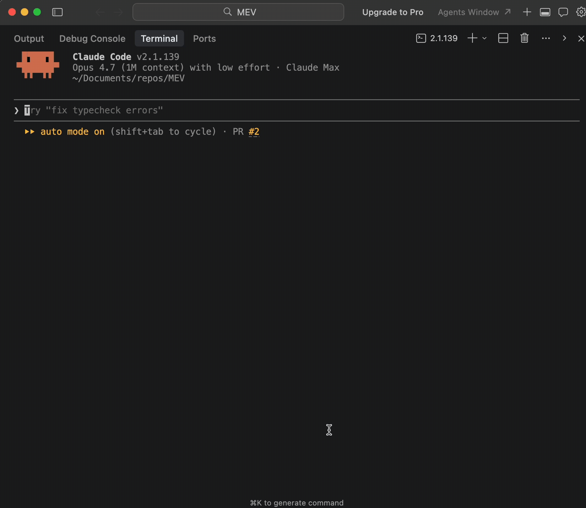

# github-pr-review-mcp

A custom **Model Context Protocol** server that gives AI clients (Claude Code, Cursor, etc.) read/write access to GitHub PRs and commits, scoped for code review workflows.

Connects via **stdio**. Works with any GitHub repo your token can reach — set defaults via env vars or pass `owner`/`repo` per call.

## Demo



Claude reads the diff, reviews it, posts a top-level comment, and tails its own audit log — all via this MCP.

## Tools

**Read**
- `list_prs(state, per_page)` — list PRs.
- `get_pr(number)` — title, body, status, diff stats, mergeable.
- `get_pr_diff(number)` — raw unified diff for review.
- `list_pr_comments(number)` — top-level + inline review comments.
- `list_commits(sha?, since?, per_page)` — branch commit history.
- `get_commit(sha)` — message, stats, file patches.
- `list_my_repos(visibility?, affiliation?, sort?, per_page)` — discover repos the token can reach (use this to find valid `owner/repo` values before other calls).

**Write**
- `add_pr_comment(number, body)` — top-level comment.
- `add_pr_review_comment(number, path, line, body, side?)` — inline diff comment.

**Introspection**
- `tail_audit_log(n?)` — return the last N entries of this server's audit log. Lets the model show you what it has been doing without leaving chat.

All tools accept optional `owner` and `repo` to override env defaults.

## Setup

1. Copy `.env.example` → `.env` and set `GITHUB_TOKEN`. **Prefer a fine-grained PAT** scoped to the repos you want to touch (Pull requests: read/write, Contents: read, Metadata: read). A classic `repo`-scoped token works too but covers every repo the user can access.
2. Optionally set `GITHUB_OWNER` / `GITHUB_REPO` as defaults.
3. Optionally configure the read/write allowlists (see [Security model](#security-model) below).
4. `npm install`
5. Smoke test: `npm run dev` — you should see `[github-pr-review] connected. default=... read=[...] write=[...] audit=...` on stderr.

## Connect to Claude Code

Easiest — use the CLI from inside your cloned folder:

```bash
claude mcp add github-pr-review --scope user -- npx -y tsx "$(pwd)/src/server.ts"
```

Or add manually to `~/.claude.json` (user-scope) or a project's `.mcp.json`:

```json
{
  "mcpServers": {
    "github-pr-review": {
      "command": "npx",
      "args": ["-y", "tsx", "/absolute/path/to/mcp-github-pr-review/src/server.ts"]
    }
  }
}
```

The server reads env from a `.env` file next to `server.ts`, so credentials don't need to live in the MCP config. (You can override with the config's `env` block if preferred.)

Restart Claude Code. Run `/mcp`. You should see `github-pr-review · ✓ connected · 10 tools`.

Verify the registration captured the server path:

```bash
claude mcp list | grep github-pr-review
```

The output should show the full `npx -y tsx /absolute/path/to/src/server.ts`. If you only see `npx -y tsx` with no path, a stale registration blocked the add (the `add` command exits with `already exists` instead of overwriting). Fix:

```bash
claude mcp remove github-pr-review --scope user
claude mcp add github-pr-review --scope user -- npx -y tsx "$(pwd)/src/server.ts"
```

## Try it

```
> list the open PRs
> get the diff of PR 12 and flag anything risky
> get_pr in owner=facebook repo=react number=12345
```

## Security model

LLMs acting under your GitHub identity warrant defense-in-depth. This server applies four layers:

**1. Token scope (your responsibility).** Use a fine-grained PAT limited to the specific repos this server should touch. Even if the model is somehow tricked into requesting another repo, the GitHub API will return 404.

**2. Repo allowlists.** `GITHUB_ALLOWED_REPOS` (read) and `GITHUB_WRITE_ALLOWED_REPOS` (write) gate every call server-side. Set to comma-separated `owner/repo` entries, or `*` for unrestricted. If unset, defaults to `${GITHUB_OWNER}/${GITHUB_REPO}` (or `*` if those aren't set). The write list defaults to the read list.

**3. Untrusted content wrapping.** PR bodies, comments, commit messages, and diff patches are returned wrapped in `<untrusted>...</untrusted>` and the affected tools' descriptions tell the model to treat that content as data, not instructions. This is a mitigation, not a guarantee — combine with the allowlists above.

**4. Append-only audit log.** Every tool call appends one JSON line to `audit.jsonl` next to the server, with timestamp, tool, owner/repo, ok/error, and a small set of whitelisted args (`number`, `sha`, `path`). The log never contains tokens, request bodies, or response bodies. Error messages are scrubbed of GitHub PAT patterns and capped at 500 chars.

### What is NOT defended

- Symlinks / repo-internal data exfiltration — once a repo is in the read allowlist, anything inside it is fair game.
- Resource exhaustion — there is no per-session rate limit or call cap. A prompt-injected malicious instruction (e.g. "list every PR on every repo and fetch each diff") can still burn through GitHub's 5,000 req/hr authenticated limit and run up LLM token cost. GitHub's own rate limit is the only hard ceiling.
- The fine-grained PAT itself — protect your `.env` like any other secret.
